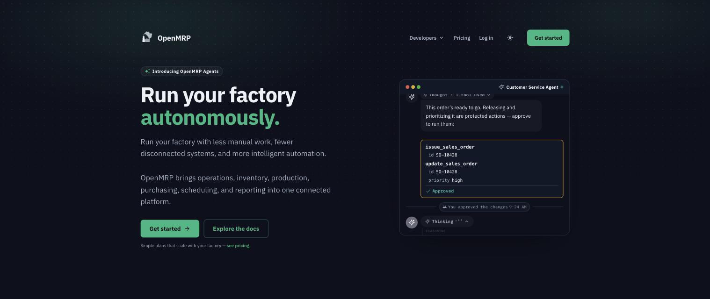
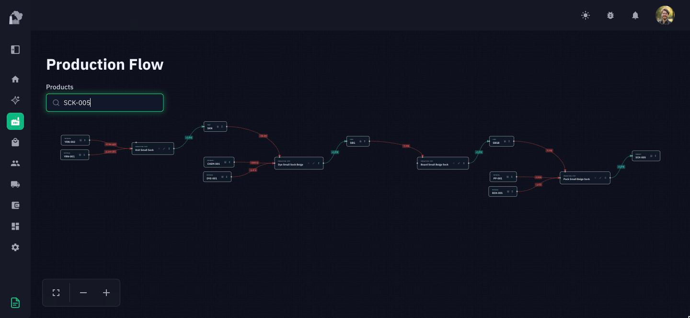
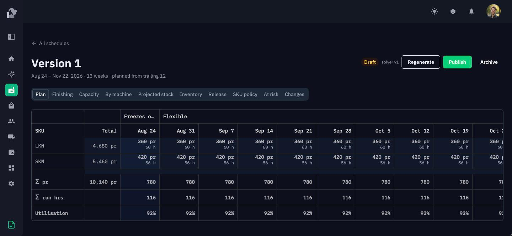
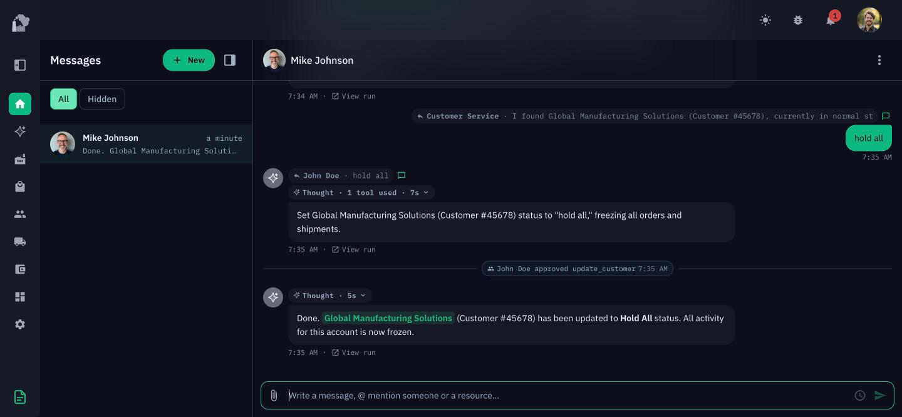
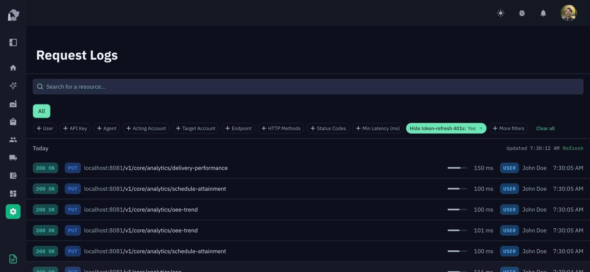
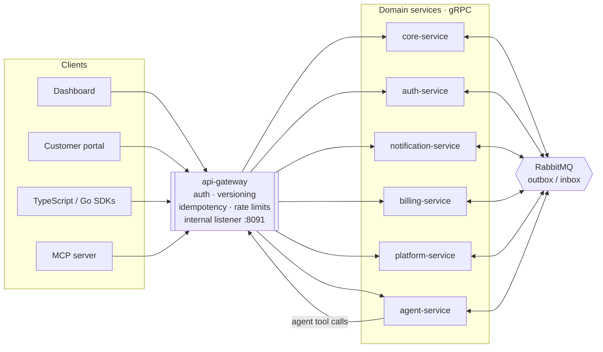

**Programmable operations for people who make things.**

An open source manufacturing platform built to make factories  
programmable, reliable, and increasingly autonomous.

[Website](https://openmrp.ai)  ·  [Documentation](https://docs.openmrp.ai)  ·  [API reference](https://docs.openmrp.ai/api-reference)  ·  [All repos](https://github.com/open-mrp)



---

## Why this exists

This project grew out of running a real manufacturing operation. It started as a way to locate material inside a circular knitting factory, and turned into the software that ran the orders, the inventory, the workflows, and eventually the operations around them.

Our philosophy is that **ERPs should be programmable infrastructure.** Our goal with OpenMRP is to provide a durable and performant foundation by which manufacturing operations can efficiently operate and automate their back office and factory operations. With this in mind, we have designed OpenMRP to scale with your company and deploy to any cloud provider or locally. Endpoints are idempotent, work is durable via transactional inboxes and outboxes, and systems are designed to be resilient to failure.

## What it does


|                     |                                                                                                                               |
| ------------------- | ----------------------------------------------------------------------------------------------------------------------------- |
| **Items**           | Materials, parts, products, product lines, categories, units of measure and unit groups                                       |
| **Engineering**     | Bills of materials, production flows, production steps, consumptions and productions, rolled-up costing                       |
| **Planning**        | Demand forecasting, demand overrides, production schedules, publishing and releasing, work lists, operating calendars         |
| **Production**      | Production runs, batches, batch operations, machines, departments, machine status and downtime tracking                       |
| **Inventory**       | Storage locations, lots, reconciliation, change logs, receipts, distribution-center locations                                 |
| **Purchasing**      | Suppliers, purchase orders, deliveries and receiving                                                                          |
| **Shop floor**      | Scanning stations, labels, picking, packing, shipping, carriers and service levels                                            |
| **Sales**           | Customers, contacts, customer groups, territories, sales reps and targets, sales orders, order discounts                      |
| **Pricing**         | Account prices, volume discounts, discount codes, payment terms, shipping terms, exemptions                                   |
| **Customer portal** | A branded, custom-domain storefront where your customers register, order, check inventory, pay, and message you               |
| **Money**           | Invoicing, accounts receivable and aging, collections, settlements, open credits, Stripe-backed transactions                  |
| **Analytics**       | Order, delivery, manufacturing and material analytics; pricing analysis; weeks of sales; quarterly orders; products on order  |
| **Communication**   | Shared inbox, threaded messaging, email domains and inboxes, notifications and preferences, retention and compliance controls |
| **Agents**          | Agent configs, runs, memories, endpoint-tools with approval gates, agents in chat, reply drafts a human approves              |
| **Platform**        | API keys, sandboxes, roles and permissions, audit events, request logs, email logs, idempotency, HubSpot and EDI integrations |


Browse the [API reference](https://docs.openmrp.ai/api-reference), or read the OpenAPI specification.

**Production flows.** A product's bill of materials and its routing are the same graph: materials feed production steps, steps yield parts, and every edge carries the quantity consumed or produced. Costs roll up along it.



**Production schedules.** A solver turns forecast demand into a week-by-week plan per SKU — run hours, utilisation, and what freezes when. It stays a draft until you publish it.



**Agents.** @mention an agent in any thread and it works the same API you do. Tools that write are gated: the run stops, a human approves by name, and only then does it continue.



**Request logs.** Every call the dashboard makes is a call you can make. Method, path, status, latency, and caller — whether that caller was a person, an API key, or an agent.



## Architecture

This repository is the backend: an HTTP gateway in front of six domain services that talk to each other over gRPC and to themselves over RabbitMQ.




Agents run inside `agent-service`, and when a run calls a tool it loops back through the gateway rather than reaching into another service directly, so an agent's writes get the same auth, versioning, idempotency, and audit trail as anyone else's. That loop lands on a second gateway listener on port 8091, a ClusterIP that is never routed publicly and is gated by a shared token.

Messages cross between services through the outbox and inbox tables, so a publish commits in the same transaction as the state change it describes. At the moment, several services share a MySQL database; this will change after we finish migrating a legacy API to this repository.


| Service                | Owns                                    | Store      |
| ---------------------- | --------------------------------------- | ---------- |
| `core-service`         | Items, production, inventory, orders    | MySQL      |
| `auth-service`         | Identity, JWTs, API keys                | MySQL      |
| `notification-service` | Email, messaging, notifications         | MySQL      |
| `billing-service`      | Subscriptions, payments                 | MySQL      |
| `platform-service`     | Audit events, request logs, idempotency | MySQL      |
| `agent-service`        | Agent runs, tools, memories             | PostgreSQL |


Every service is layered the same way:


| Layer          | Responsibility                                                          |
| -------------- | ----------------------------------------------------------------------- |
| **Transport**  | Thin, stateless HTTP / gRPC / RabbitMQ handlers. No business logic.     |
| **Service**    | Business logic and transaction boundaries.                              |
| **Mediator**   | Reusable business steps, shared across services.                        |
| **Repository** | Data persistence. SQL lives here, compiled by [sqlc](https://sqlc.dev). |
| **Domain**     | Models, interfaces, and generated mocks.                                |


```
services/[name]/
├── cmd/                        # Entry point (main.go, run.go, config.go)
├── internal/
│   ├── service/                # Business logic
│   ├── domain/                 # Models, interfaces, mocks
│   ├── mediator/               # Reusable business steps
│   └── infrastructure/
│       ├── repository/         # Data access
│       ├── grpc/               # gRPC handlers and clients
│       ├── queries/            # SQL
│       └── sqlc/               # Generated DB code
└── pkg/                        # Types other services may import
```

Cross-cutting concerns live in `shared/`: gRPC interceptors and identity propagation (`contracts/`), API error types with HTTP and gRPC mappings (`errors/`), prefixed entity IDs (`id/`), RabbitMQ with outbox/inbox delivery (`messaging/`), migrations and pooling (`db/`), and domain enums (`constants/`).

### Tech stack


|                         |                                                                      |
| ----------------------- | -------------------------------------------------------------------- |
| Go 1.27                 | gRPC + Protocol Buffers, via [buf](https://buf.build)                |
| MySQL 8 · PostgreSQL 16 | [sqlc](https://sqlc.dev) · [goose](https://github.com/pressly/goose) |
| RabbitMQ                | OpenTelemetry tracing                                                |
| Kubernetes / EKS        | [Tilt](https://tilt.dev) + minikube for local dev                    |
| Stripe                  | AWS S3 · SES · SQS                                                   |
| Anthropic Claude        |                                                                      |


## The project

OpenMRP is split across repositories rather than a monorepo. Everything below is Apache 2.0.


| Repo                                                     | What it is                                                                               |
| -------------------------------------------------------- | ---------------------------------------------------------------------------------------- |
| **[api](https://github.com/open-mrp/api)** (this repo)   | The Go microservices, the REST API, and the OpenAPI specifications                       |
| [dashboard](https://github.com/open-mrp/dashboard)       | The Next.js dashboard and customer portal, plus their Express API                        |
| [ui](https://github.com/open-mrp/ui)                     | `@openmrp/ui` — the React component library both frontends are built from                |
| [internal-sdk](https://github.com/open-mrp/internal-sdk) | `@openmrp/internal-sdk` — the TypeScript client the dashboard uses                       |
| [openmrp-go](https://github.com/open-mrp/openmrp-go)     | The Go SDK                                                                               |
| [public-docs](https://github.com/open-mrp/public-docs)   | [docs.openmrp.ai](https://docs.openmrp.ai) — the guides plus the generated API reference |


## Using the API

Authenticate with a bearer API key, name the account you're acting on, and pin a version:

```bash
curl https://api.openmrp.ai/v1/catalog/items \
  -H "Authorization: Bearer $OPENMRP_API_KEY" \
  -H "OpenMRP-Account: acct_..." \
  -H "OpenMRP-Version: 1.0.forge-preview.3"
```

```ts
import OpenMRP from "@openmrp/sdk";

const client = new OpenMRP({ bearerToken: process.env["OPENMRP_API_KEY"] });
const items = await client.catalog.items.list();
```

```go
client := openmrp.NewClient(
    option.WithBearerToken(os.Getenv("OPENMRP_API_KEY")),
    option.WithOpenMRPAccountID("acct_..."),
)
items, err := client.Catalog.Items.List(ctx, openmrp.CatalogItemListParams{})
```

Sandboxes, idempotency keys, pagination, `?include=` expansion, request IDs, and rate limits are covered in the [developer guides](https://docs.openmrp.ai/api-reference). AI assistants can drive the same API through the [MCP server](https://docs.openmrp.ai/api-reference/mcp-server).

## Running it locally


### Prerequisites

- Go 1.27+
- Docker
- [minikube](https://minikube.sigs.k8s.io/)
- [Tilt](https://tilt.dev/)
- [protoc](https://protobuf.dev/installation/) — only needed for `make proto`; pin to the version in `tools/tool-versions` (`protoc --version` must match, else `make proto` refuses to run to avoid version-stamp drift)

`make install-tools` installs everything else (buf, sqlc, goose, mockgen, gotestsum, vacuum, the protoc plugins, gosec, staticcheck, goimports) at the versions pinned in `tools/tool-versions`.

### Setup

```bash
make install-tools  # Install dev dependencies
make setup          # Start minikube and the local databases (migrations + seed data)
make dev            # Spin up the environment with Tilt
```

`make teardown` reverses it: deletes minikube, nukes the local databases, and tears down the E2E stack.

### Common commands

`make help` lists every target. `make sqlc` and `make mocks` take service arguments — either the full directory name (`core-service`) or its short alias (`core`, `auth`, `notification`, `logging` → platform-service, `payment` → billing-service, `agent`, `api`). With no argument they run against every service.

```bash
make sqlc [service]     # Generate database code from SQL queries
make proto              # Generate Go protobuf bindings
make mocks [service]    # Generate mock implementations
make generate           # Regenerate OpenAPI specs, Stainless configs, and agent tools
make test               # Run all tests
make e2e                # Bring up the E2E stack and run the E2E tests
make lint               # gosec + staticcheck + tx audit + committed-binary check
make fmt                # Format Go sources
```

**Local databases, seed data, and Stripe**

`make local-db` spins up both databases in Docker containers, applies all migrations, and writes connection strings to `.env` automatically:

- **MySQL 8** on port `3306` — core-service (`openmrp` database)
- **PostgreSQL 16** on port `5432` — agent-service (`openmrp_agents` database)

Data is persisted in named Docker volumes so it survives container restarts. `make local-db` also seeds the core database with sample data (accounts, users, items, orders, etc.) via the SQL files in `shared/db/seed/`, and — when `STRIPE_SECRET_KEY` is set — creates a matching Stripe test subscription for the seeded account. Without that variable the Stripe step is skipped with a warning; run `make seed-stripe` later to add it.

```bash
# Re-seed core data (idempotent, safe to run multiple times)
make seed-core

# Seed with a specific plan (default: enterprise)
make seed-core ARGS="--plan starter"

# Seed the agent-service (PostgreSQL) database with e2e test data
# Migrations for it already ran as part of `make local-db`
make seed-agent-db

# Upload the seeded users' avatars to the user-photos S3 bucket
make seed-user-photos

# Connect directly
make local-db-cli   # MySQL CLI using DB_URL from .env
psql postgres://openmrp@localhost:5432/openmrp_agents

# Tear down containers (data preserved)
make local-db-down

# Tear down containers, clean up Stripe test resources, and delete all data (volumes)
# Run `make local-db` after to get clean databases with fresh migrations and seed data
make local-db-nuke
```


#### Using with Tilt / Kubernetes

Services running in minikube cannot reach `localhost` on the host machine. The K8s secret in `infra/development/kubernetes/config/secrets.yaml` uses `host.minikube.internal` to route traffic back to the host. These URIs match the Docker Compose databases started by `make local-db`:


| Service            | URI                                                                             |
| ------------------ | ------------------------------------------------------------------------------- |
| Core (MySQL)       | `root:Testing123!@tcp(host.minikube.internal:3306)/openmrp`                     |
| Agent (PostgreSQL) | `postgres://openmrp@host.minikube.internal:5432/openmrp_agents?sslmode=disable` |


The seed script hardcodes the Docker Compose connection details, so no `.env` configuration is needed — just run `make local-db` before `make dev`.

**Agent endpoint-tools (optional)**

Agents can invoke api-gateway endpoints flagged `AgentTool: true` (see `make gen-agent-tools`). This uses a dedicated **internal** api-gateway listener on port 8091, reached over the `api-gateway-internal` ClusterIP Service and gated by a shared token. The token is optional in dev: when it is absent the internal listener does not start and the endpoint-tools are simply unavailable (the rest of the agent works normally).

To enable it locally, add an `internal-service-token` secret to your `infra/development/kubernetes/config/secrets.yaml`:

```yaml
apiVersion: v1
kind: Secret
metadata:
  name: internal-service-token
type: Opaque
stringData:
  token: "dev-internal-token" # any non-empty value in dev
```

Both `api-gateway` and `agent-service` already consume this secret (as `INTERNAL_SERVICE_TOKEN`) and the `API_GATEWAY_INTERNAL_URL` config value. In production the token is generated and delivered by Terraform in the private infra repo.

> **minikube acting up?** `minikube delete && minikube start` clears most of it.


## Contributing

Pull requests are welcome — including on the parts of this README that are wrong.

**Read the pattern docs before you write.** `AGENTS.md` and the docs in `docs/patterns/` are the normative spec for this codebase — layering, API versioning, nullable fields, authorization, audit events, entity IDs, logging, comments. Where a doc and existing code disagree, the doc wins. Imitating the file next to yours is the most common way to get a change rejected.

**Branch** from `main` with a descriptive name:

```bash
git checkout -b feature/your-feature-name   # or bug/your-bug-name
```

**Commit** with [Conventional Commits](https://www.conventionalcommits.org/) — [release-please](https://github.com/googleapis/release-please) reads them to calculate the next version:


| Prefix   | Type of change   | Version impact |
| -------- | ---------------- | -------------- |
| `fix:`   | Bug fixes        | Patch (0.0.x)  |
| `feat:`  | New features     | Minor (0.x.0)  |
| `feat!:` | Breaking changes | Major (x.0.0)  |


**A breaking change to the public API needs a new API version and a transformer** that preserves the old shape for pinned clients. `docs/patterns/api-versioning-patterns.md` is the checklist — follow it, don't approximate it.

**Releases.** Once a PR merges, release-please maintains a Release PR that aggregates pending changes and updates the changelog; merging that PR cuts the release and deploys. This repo builds service images and pushes them to ECR, then asks the private infra repo to roll them out — nothing here holds a credential that can reach the cluster. Two consequences: infrastructure changes ship separately and must land *before* a release that depends on them, and manifest-only changes are a push to that repo rather than a release here. `infra/development/` stays here — it is what `make dev` runs against, and it holds no production identifiers.

## Security

Found a vulnerability? Email **[security@openmrp.ai](mailto:security@openmrp.ai)** rather than opening an issue — see [SECURITY.md](SECURITY.md) for scope and what to include.

Every `sk_test_`, `mrp_sk_test_`, `whsec_` and JWT in this repository is fabricated sample or fixture data. If you find one that resolves against a real service, that is a genuine finding.

## License

[Apache 2.0](LICENSE).

"OpenMRP" and "Augno", with their logos and wordmarks, are trademarks of Augno, Inc. Section 6 of the license grants no trademark rights — see [TRADEMARKS.md](TRADEMARKS.md).
